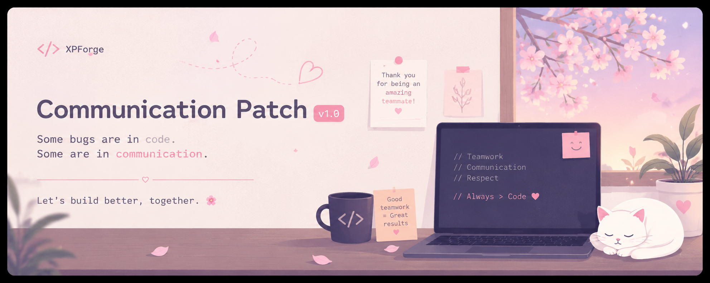

<p align="center">
  
</p>

<h1 align="center">
🌸 Communication Patch 🌸
</h1>

<p align="center">
<i>A tiny update... not for the project, but for teamwork. 🤍</i>
</p>

<br>

<p align="center">
  
</p>

---

<p align="center">
✨━━━━━━━━━━━━━━━━━━━━━━━━━━━━━━━━━━━━━━✨
</p>

<h2 align="center">📦 Repository Structure</h2>

```text
communication-patch/
│
├── 📄 README.md
├── 🐞 BUG_REPORT.md
├── 📜 CHANGELOG.md
├── 💚 teamwork.patch
├── 🎮 xpforge.log
└── 🔒 SECRET.txt
```

<p align="center">
<i>Every repository tells a story.<br>
This one just happens to be about fixing a communication bug. 🌸</i>
</p>

---

<p align="center">


</p>
